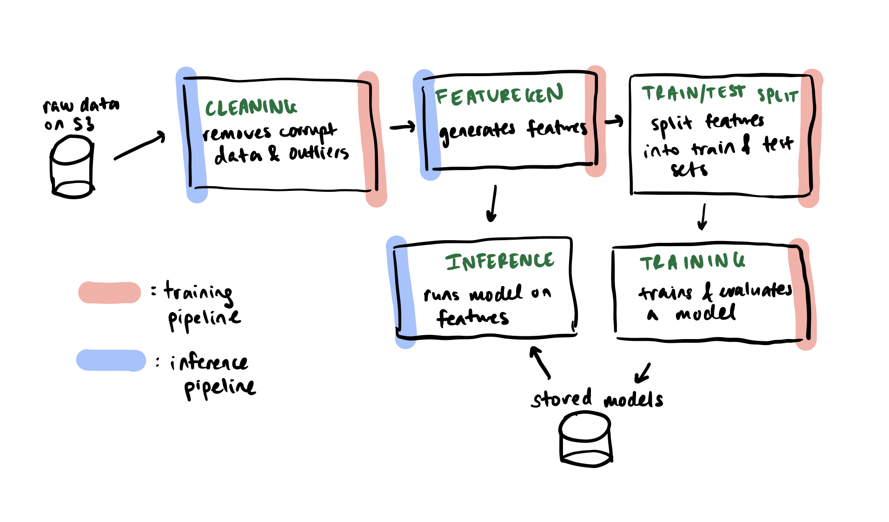
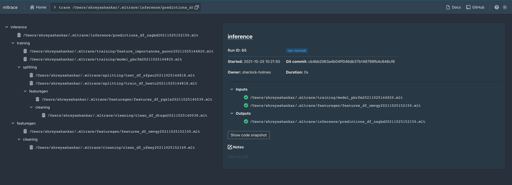

# mltrace tutorial

Date: October 2021

This tutorial builds a training and testing pipeline for a toy ML prediction problem: to predict whether a passenger in a NYC taxicab ride will give the driver a nontrivial tip. This is a **binary classification task.** A nontrivial tip is arbitrarily defined as greater than 10% of the total fare (before tip). To evaluate the model or measure the efficacy of the model, we measure the [**F1 score**](https://en.wikipedia.org/wiki/F-score). This task is modeled after the task described in [toy-ml-pipeline](https://github.com/shreyashankar/toy-ml-pipeline).

The purpose of this tutorial is to demonstrate how mltrace can be used in achieving pipeline *observability*, or end-to-end visibility. In this tutorial, we:

1. Train a model on data from January 2020
2. Simulate deployment by running inference on a weekly basis from February 1, 2020 to May 31, 2020
3. Experience a significant performance decrease in our pipeline (from 83% F1 score to below 70%)
4. Instrument our pipeline with mltrace component specifications to trace our predictions and debug the pipeline
5. Encode tests into the component specifications to catch failures before they happen

I am giving this tutorial at [RISECamp 2021](https://risecamp.berkeley.edu/) and the [Toronto Machine Learning Summit](https://www.torontomachinelearning.com/). You can also follow along with this README.

## Requirements

**You can do this entire tutorial locally.** You will need the following:

* Internet connection to download the data
* Docker (you can install [here](https://www.docker.com/products/docker-desktop))
* Python 3.7+
* Unix-based shell (use WSL if on Windows)

We recommend you create a conda or virtual environment for this demo.

## Step 1: Setup

Clone two repositories: [mltrace](https://github.com/loglabs/mltrace) and [this mltrace-demo tutorial](https://github.com/loglabs/mltrace-demo). Set up mltrace as described in the mltrace [README](https://github.com/loglabs/mltrace#readme). Verify that you can access the mltrace UI at [localhost:8080](http://localhost:8080). Make sure your containers are running for the entirety of this tutorial.

Once you have cloned [this mltrace-demo tutorial](https://github.com/loglabs/mltrace-demo), navigate to the root and download the requirements by running `pip install -r requirements.txt`. The data science-specific libraries used are `pandas` and `scikit-learn`.

## Step 2: Understand the ML task and pipelines

For the rest of this tutorial, we will only be working in the `mltrace-demo` directory.

### Dataset description

We use the yellow taxicab trip records from the NYC Taxi & Limousine Comission [public dataset](https://www1.nyc.gov/site/tlc/about/tlc-trip-record-data.page), which is stored in a public aws S3 bucket. The data dictionary can be found [here](https://www1.nyc.gov/assets/tlc/downloads/pdf/data_dictionary_trip_records_yellow.pdf) and is also shown below:

| Field Name      | Description |
| ----------- | ----------- |
| VendorID      | A code indicating the TPEP provider that provided the record. 1= Creative Mobile Technologies, LLC; 2= VeriFone Inc.       |
| tpep_pickup_datetime   | The date and time when the meter was engaged.        |
| tpep_dropoff_datetime   | The date and time when the meter was disengaged.        |
| Passenger_count   | The number of passengers in the vehicle. This is a driver-entered value.      |
| Trip_distance   | The elapsed trip distance in miles reported by the taximeter.      |
| PULocationID   | TLC Taxi Zone in which the taximeter was engaged.      |
| DOLocationID   | TLC Taxi Zone in which the taximeter was disengaged      |
| RateCodeID   | The final rate code in effect at the end of the trip. 1= Standard rate, 2=JFK, 3=Newark, 4=Nassau or Westchester, 5=Negotiated fare, 6=Group ride     |
| Store_and_fwd_flag | This flag indicates whether the trip record was held in vehicle memory before sending to the vendor, aka “store and forward,” because the vehicle did not have a connection to the server. Y= store and forward trip, N= not a store and forward trip |
| Payment_type | A numeric code signifying how the passenger paid for the trip. 1= Credit card, 2= Cash, 3= No charge, 4= Dispute, 5= Unknown, 6= Voided trip |
| Fare_amount | The time-and-distance fare calculated by the meter. | 
| Extra | Miscellaneous extras and surcharges. Currently, this only includes the $0.50 and $1 rush hour and overnight charges. |
| MTA_tax | $0.50 MTA tax that is automatically triggered based on the metered rate in use. | 
| Improvement_surcharge | $0.30 improvement surcharge assessed trips at the flag drop. The improvement surcharge began being levied in 2015. | 
| Tip_amount | Tip amount – This field is automatically populated for credit card tips. Cash tips are not included. | 
| Tolls_amount | Total amount of all tolls paid in trip. | 
| Total_amount | The total amount charged to passengers. Does not include cash tips. |

We have subsampled the data from January to May 2020 to simplify the tutorial. To download the data, in the root directory of this repo, run the download script `download.sh`, and you should see something like the following:

```
> source download.sh

  % Total    % Received % Xferd  Average Speed   Time    Time     Time  Current
                                 Dload  Upload   Total   Spent    Left  Speed
100   388    0   388    0     0    129      0 --:--:--  0:00:03 --:--:--   129
100 15.5M  100 15.5M    0     0  3331k      0  0:00:04  0:00:04 --:--:-- 11.0M
  % Total    % Received % Xferd  Average Speed   Time    Time     Time  Current
                                 Dload  Upload   Total   Spent    Left  Speed
100   388    0   388    0     0    131      0 --:--:--  0:00:02 --:--:--   130
100 15.2M  100 15.2M    0     0  3046k      0  0:00:05  0:00:05 --:--:-- 11.2M
  % Total    % Received % Xferd  Average Speed   Time    Time     Time  Current
                                 Dload  Upload   Total   Spent    Left  Speed
100   388    0   388    0     0    281      0 --:--:--  0:00:01 --:--:--   281
100 7678k  100 7678k    0     0  3103k      0  0:00:02  0:00:02 --:--:-- 8785k
  % Total    % Received % Xferd  Average Speed   Time    Time     Time  Current
                                 Dload  Upload   Total   Spent    Left  Speed
100   388    0   388    0     0    928      0 --:--:-- --:--:-- --:--:--   926
100  684k  100  684k    0     0   868k      0 --:--:-- --:--:-- --:--:--  868k
  % Total    % Received % Xferd  Average Speed   Time    Time     Time  Current
                                 Dload  Upload   Total   Spent    Left  Speed
100   388    0   388    0     0    603      0 --:--:-- --:--:-- --:--:--   602
100 1024k  100 1024k    0     0   982k      0  0:00:01  0:00:01 --:--:--  982k
```

### Pipeline description

Any applied ML pipeline is essentially a series of functions applied one after the other, such as data transformations, models, and output transformations. For simplicity, the training and inference pipelines are both included in one Python file: `main.py`. The only external tools  These pipelines have the following components:



In the diagram above, both pipelines share some components, such as cleaning and feature generation. In the pipeline code (`main.py`), each component corresponds to a different Python function. 

## Step 2: Run pipelines

Since the inference pipeline depends on a trained model, you must run the training pipeline first to train and save a model. The training pipeline takes in a date range, trains a random forest classifier on the first 80% of data, and evaluates the model on the last 20%. For more details on model parameters and features, read the code in the `train_model` function. To run the training pipeline, execute `python main.py --mode=training`, and you will see something like the following:

```
> python main.py --mode=training

Running the training pipeline from 01/01/2020 to 01/31/2020...
Train scores:
{'accuracy_score': 0.7111377217389263, 'f1_score': 0.820004945200449, 'precision_score': 0.7167432688544968, 'recall_score': 0.9580287853406722}
Test scores:
{'accuracy_score': 0.7304694103724853, 'f1_score': 0.8354623429043206, 'precision_score': 0.7372079610648481, 'recall_score': 0.9639346431170206}
                feature  importance
0  congestion_surcharge    0.692435
1            RatecodeID    0.122799
2       passenger_count    0.084634
3         trip_distance    0.056488
4           pickup_hour    0.030117
5        pickup_weekday    0.006432
6        loc_code_diffs    0.005208
7            work_hours    0.001844
8         pickup_minute    0.000041
```

One can probably come up with a better-performing model, but that is not the goal of this tutorial. *The goal here is to demonstrate that performance can decrease post-deployment.* To simulate a week of deployment, run the script in inference mode and see the result:

```
> python main.py --mode=inference --start=02/01/2020 --end=02/08/2020

Running the inference pipeline from 02/01/2020 to 02/08/2020...
{'accuracy_score': 0.7331414566141254, 'f1_score': 0.8376663049524453, 'precision_score': 0.7420173022399211, 'recall_score': 0.9616234153694767}
```

We see similar metrics to what we observed at training time, which is all good (for now). To run inference on every week starting February 1, 2020, we can run the `run_weekly_inference.py` script and see its results:

```
> python run_weekly_inference.py

python main.py --mode=inference --start=02/01/2020 --end=02/08/2020
Running the inference pipeline from 02/01/2020 to 02/08/2020...
{'accuracy_score': 0.7331414566141254, 'f1_score': 0.8376663049524453, 'precision_score': 0.7420173022399211, 'recall_score': 0.9616234153694767}
python main.py --mode=inference --start=02/08/2020 --end=02/15/2020
Running the inference pipeline from 02/08/2020 to 02/15/2020...
{'accuracy_score': 0.7278759275705908, 'f1_score': 0.8340398483417413, 'precision_score': 0.7359328219671536, 'recall_score': 0.9623274935955706}
python main.py --mode=inference --start=02/15/2020 --end=02/22/2020
Running the inference pipeline from 02/15/2020 to 02/22/2020...
{'accuracy_score': 0.7045651653189503, 'f1_score': 0.8166364204935767, 'precision_score': 0.7111136903380176, 'recall_score': 0.9589333012280279}
python main.py --mode=inference --start=02/22/2020 --end=02/29/2020
Running the inference pipeline from 02/22/2020 to 02/29/2020...
{'accuracy_score': 0.7290757048767853, 'f1_score': 0.8342193683943596, 'precision_score': 0.7373325008404976, 'recall_score': 0.9604204028860992}
python main.py --mode=inference --start=02/29/2020 --end=03/07/2020
Running the inference pipeline from 02/29/2020 to 03/07/2020...
{'accuracy_score': 0.7036537211975809, 'f1_score': 0.8167176728801508, 'precision_score': 0.7090333315442006, 'recall_score': 0.9629683627350926}
python main.py --mode=inference --start=03/07/2020 --end=03/14/2020
Running the inference pipeline from 03/07/2020 to 03/14/2020...
{'accuracy_score': 0.7281746780953819, 'f1_score': 0.8319688154662216, 'precision_score': 0.7334478820491188, 'recall_score': 0.9610645239571818}
python main.py --mode=inference --start=03/14/2020 --end=03/21/2020
Running the inference pipeline from 03/14/2020 to 03/21/2020...
{'accuracy_score': 0.6889874250874701, 'f1_score': 0.7913742622112748, 'precision_score': 0.6840752048851036, 'recall_score': 0.9385955241979936}
python main.py --mode=inference --start=03/21/2020 --end=03/28/2020
Running the inference pipeline from 03/21/2020 to 03/28/2020...
{'accuracy_score': 0.6451420029895366, 'f1_score': 0.7327178563386625, 'precision_score': 0.6134992458521871, 'recall_score': 0.9094466182224706}
python main.py --mode=inference --start=03/28/2020 --end=04/04/2020
Running the inference pipeline from 03/28/2020 to 04/04/2020...
{'accuracy_score': 0.6284492809949476, 'f1_score': 0.7137724550898203, 'precision_score': 0.5840274375306223, 'recall_score': 0.9176289453425712}
python main.py --mode=inference --start=04/04/2020 --end=04/11/2020
Running the inference pipeline from 04/04/2020 to 04/11/2020...
{'accuracy_score': 0.6171894294887627, 'f1_score': 0.7053231939163498, 'precision_score': 0.5848045397225725, 'recall_score': 0.8884099616858238}
python main.py --mode=inference --start=04/11/2020 --end=04/18/2020
Running the inference pipeline from 04/11/2020 to 04/18/2020...
{'accuracy_score': 0.5968436154949784, 'f1_score': 0.6916605705925385, 'precision_score': 0.5858116480793061, 'recall_score': 0.8441964285714286}
python main.py --mode=inference --start=04/18/2020 --end=04/25/2020
Running the inference pipeline from 04/18/2020 to 04/25/2020...
{'accuracy_score': 0.6017305893358279, 'f1_score': 0.697567039602202, 'precision_score': 0.5843498958643261, 'recall_score': 0.8651982378854626}
python main.py --mode=inference --start=04/25/2020 --end=05/02/2020
Running the inference pipeline from 04/25/2020 to 05/02/2020...
{'accuracy_score': 0.5893766674751395, 'f1_score': 0.6827805883455125, 'precision_score': 0.5769474350854972, 'recall_score': 0.8361633776961909}
python main.py --mode=inference --start=05/02/2020 --end=05/09/2020
Running the inference pipeline from 05/02/2020 to 05/09/2020...
{'accuracy_score': 0.5838457703174339, 'f1_score': 0.6434064369125606, 'precision_score': 0.5146958304853042, 'recall_score': 0.8579567033801747}
python main.py --mode=inference --start=05/09/2020 --end=05/16/2020
Running the inference pipeline from 05/09/2020 to 05/16/2020...
{'accuracy_score': 0.5933857808857809, 'f1_score': 0.6362570050827577, 'precision_score': 0.5070627336933943, 'recall_score': 0.8537950332284016}
python main.py --mode=inference --start=05/16/2020 --end=05/23/2020
Running the inference pipeline from 05/16/2020 to 05/23/2020...
{'accuracy_score': 0.6166423357664234, 'f1_score': 0.6921453692848769, 'precision_score': 0.577351848230002, 'recall_score': 0.8639157155399473}
python main.py --mode=inference --start=05/23/2020 --end=05/30/2020
Running the inference pipeline from 05/23/2020 to 05/30/2020...
{'accuracy_score': 0.6198235909702496, 'f1_score': 0.7046800603878759, 'precision_score': 0.5951353471949784, 'recall_score': 0.8636493025903786}
```

Wow! Towards the end, we see significantly lower F1 scores! How do we even *begin* to go about debugging this performance drop? In the remainder of this tutorial, we will discuss how to use mltrace to observe data flow and debug our pipelines.

## Step 3: Instrument our pipelines with mltrace

A natural first step in debugging is to trace our outputs, or determine the end-to-end data flow for the outputs. Fortunately, we can do this with mltrace *without completely redesigning our pipelines and rewriting our code!* We will only need to add code.

mltrace provides an interface to define component specifications which can run tests and log data flow throughout our pipelines. For this tutorial, we have already defined component specifications in `components.py`, and we just need to integrate these into our pipelines. An example component specification is the following:

```python

from mltrace import Component

class Cleaning(Component):
    def __init__(self, beforeTests=[], afterTests=[]):

        super().__init__(
            name="cleaning",
            owner="plumber",
            description="Cleans raw NYC taxicab data",
            tags=["nyc-taxicab"],
            beforeTests=beforeTests,
            afterTests=afterTests,
        )

```

To integrate this component into our pipeline, we declare a `Cleaning` object in `main.py` and decorate our existing `cleaning` function with the Component object's `run` method:

```python
from components import *

@Cleaning().run(auto_log=True) # This is the only line of mltrace code to add
def clean_data(
    df: pd.DataFrame, start_date: str = None, end_date: str = None
) -> pd.DataFrame:
    """
    This function removes rows with negligible fare amounts and out of bounds of the start and end dates.

    Args:
        df: pd dataframe representing data
        start_date (optional): minimum date in the resulting dataframe
        end_date (optional): maximum date in the resulting dataframe (not inclusive)

    Returns:
        pd: DataFrame representing the cleaned dataframe
    """
    df = df[df.fare_amount > 5]  # throw out neglibible fare amounts
    if start_date:
        df = df[df.tpep_dropoff_datetime.dt.strftime("%m/%d/%Y") >= start_date]
    if end_date:
        df = df[df.tpep_dropoff_datetime.dt.strftime("%m/%d/%Y") < end_date]

    clean_df = df.reset_index(drop=True)
    return clean_df
```

The `auto_log` parameter tells mltrace to automatically find and log input and output data and artifacts (e.g., models), even if we didn't explicitly save them (like in our example). Here, mltrace would log `df` as input and `clean_df` as output.

### Exercise 1: Instrument other functions

Like we did for `cleaning`, instrument the following functions with their respective component specifications. You can see all the component specifications in `components.py`. Solution code exists in `solutions/main.py`. *Hint: you will only have to instrument 4 other functions!*

## Step 4: Tracing and debugging

Rerun our pipelines as we did above. This time, our pipelines will be instrumented with mltrace, so we can inspect traces for our outputs. To do so, run the following commands:

```
python main.py --mode=training
python run_weekly_inference.py
```

Once inference has finished running, navigate to the UI at [localhost:8080](http://localhost:8080) to check out the mltrace component runs. Type in `history inference` into the command bar and press enter to see the most recent runs of the inference component. Click on one of the first few / most recent rows in the table, then click on the output filename in the card to trace it. The resulting view will look something like:



The trace is a bit complicated, but we can look at some of the intermediate outputs to assess what might have gone wrong with the pipeline.

### Exercise 2: Load and analyze intermediates

To begin, let's look at the features fed into this particular run of inference and compare these features to training features. In this exercise, you will identify the two filenames that correspond to the training and inference features, load these into dataframes in a seperate notebook, and determine a few differences between these feature dataframes.

1. Look at the trace view in the mltrace UI. Identify the two filenames that correspond to the training and inference features.
2. Copy these filenames into a separate doc. You will want to load them to inspect the data.
3. [OPTIONAL] Open a Jupyter notebook to load these files into dataframes and compare the dataframes. You can load a file by calling `mltrace.load(filename)`. What differences do you find? Did the data "drift" over time?

*Note: The UI is still a major work in progress! There's a lot of functionality we can add here to make it significantly easier to debug. Please email shreyashankar@berkeley.edu if you are interested in contributing!*

## Step 5: Encode some tests into components

mltrace components have a simple lifecycle: they can run `beforeTests` that execute before a component runs and `afterTests` that execute after a component runs. We will leverage this functionality to encode tests to execute at runtime. For this tutorial, we have some predefined tests, defined in `tests.py`:


| Test Class Name  | Description |
| ------------- | ------------- |
|  `OutliersTest`  | Prints summary statistics of the data and tests for z-score outliers.  |
| `TrainingAssumptionsTest`  |  Tests for train-test leakage and makes sure the data does not have a large class imbalance. |
| `ModelIntegrityTest`  |  Checks that the model did not overfit and that feature importances aren't heavily skewed towards a small fraction of features. |

Each of these test classes contain several test functions to run. The arguments to these test functions *must be* defined in the body of the component run function (i.e., the function that `Component().run` is decorating). Under the hood, mltrace traces the Python code and passes arguments to the tests before and after the component run function is executed.

*Note that these tests are not applicable to all ML tasks! For instance, sometimes we will want to be solving problems with class imbalance.*

### Exercise 3: Add tests to mltrace components

Each mltrace component accepts a list of `beforeTests` and `afterTests`. We can add tests to either the component specifications in `components.py` or the decorators in `main.py`. The main benefit to having this test abstraction is that now, tests can be reusable between components and even pipelines. For an example, we can add the `OutliersTest` to the `featuregen` component:

```python
from tests import *

@Featuregen(afterTests=[OutliersTest]).run(auto_log=True)
def featuregen(...):
```

In this example, the `OutliersTest` will be executed on the features dataframe that gets returned from the function. In this exercise, we will add other tests to be executed. Solution code exists in `solutions/main.py`.

1. Add the `TrainingAssumptionsTest` and `ModelIntegrityTest` to components in the training pipeline. *Hint: training assumptions should be satisfied before training, and model integrity should be satisfied after training!*
2. Run the pipelines (`python main.py --mode=training; python run_weekly_inference.py`) as we have done before. Some runs of inference should fail the outliers test.
3. [OPTIONAL] Encode your own tests, based on the analysis you did in exercise 2.

## Step 6: Takeaways

In this tutorial, we did the following:

1. Train a model
2. Simulate deployment by running inference on a weekly basis
3. Use mltrace to investigate the performance drop and add tests to our pipeline

Questions? Feedback? Please email shreyashankar@berkeley.edu!

## Future work

mltrace doesn't fix pipelines; our goal is to aid practitioners in debugging and creating sustaining pipelines. We want mltrace to be as flexible as possible, to serve as an "add-on" to existing pipelines to achieve observability. We are most immediately working on the following:

* Materializing historical component run inputs and outputs to use while writing running tests (e.g., to compare successive batches of data fed into a component)
* Logging component run parameters and showing visualizations in the UI
* Predefined components with tests that practitioners can use to construct pipelines "off-the-shelf"
